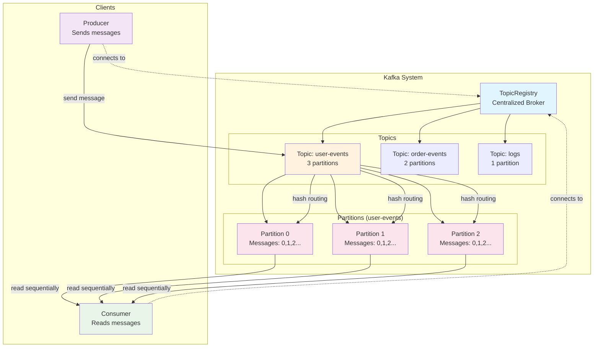

# Kafka Internals - Data Structures Learning

Learn Java server-side programming and data structures by implementing Kafka's core components in memory.

## 🚀 Quick Start

1. **Run tests to see what needs to be implemented**:
   ```bash
   mvn test
   ```

2. **Follow the learning path**: See `KAFKA_LEARNING_PATH.md` for complete guidance

3. **All phases complete!** Run the full test suite:
   ```bash
   mvn test  # All 39 tests passing!
   ```

## 📋 Current Progress

- ✅ **Phase 1: KafkaMessage** - COMPLETE (10/10 tests passing)
- ✅ **Phase 2: Partition** - COMPLETE (7/7 tests passing)
- ✅ **Phase 3: Topic** - COMPLETE (5/5 tests passing)
- ✅ **Phase 4: Producer/Consumer** - COMPLETE (13/13 tests passing)
- ✅ **Phase 6: Concurrency & Thread Safety** - COMPLETE (4/4 tests passing)

**🎯 Total: 39/39 tests passing!**

## 📚 Learning Approach

**Test-Driven Development (TDD)**:
- Tests are fully implemented (guide your work)
- Implementation classes have TODOs and guidance
- You implement code to make tests pass
- Incremental learning, one concept at a time

## 📁 Key Files

- **`KAFKA_LEARNING_PATH.md`** - Complete learning guide (single source of truth)
- **`lessons/`** - Concept explanations (read these first!)
- **`src/test/java/`** - Complete tests (define what to build)
- **`src/main/java/`** - Your implementations (with TODOs)
- **`pom.xml`** - Maven build configuration

## 🎯 Next Steps

## 🏗️ **System Architecture**



## 🎯 **What You've Built - Complete Kafka MVP!**

**Core Components:**
- ✅ **KafkaMessage** - Immutable message objects with builder pattern
- ✅ **Partition** - Append-only log with sequential offsets (Thread-Safe!)
- ✅ **Topic** - Hash-based message routing across multiple partitions
- ✅ **Producer** - Clean API for sending messages to topics
- ✅ **Consumer** - Iterator-style API for reading messages
- ✅ **TopicRegistry** - Centralized broker for topic management

**Key Features:**
- 🔀 **Hash-based partitioning** for consistent message routing
- 📝 **Sequential offsets** for message ordering within partitions
- 🔄 **Round-robin distribution** for null-key messages
- 🏗️ **Clean architecture** with independent Producer/Consumer
- 🔒 **Thread safety** using real Kafka synchronization patterns
- ⚡ **Performance analysis** - 625K+ messages/sec with data integrity
- ✅ **Comprehensive testing** with 39 passing tests

## 🛠️ Technologies

- Java 17, Maven, JUnit 5
- KISS Principle (Keep It Simple, Stupid)

**For detailed guidance, see `KAFKA_LEARNING_PATH.md`** 📖
